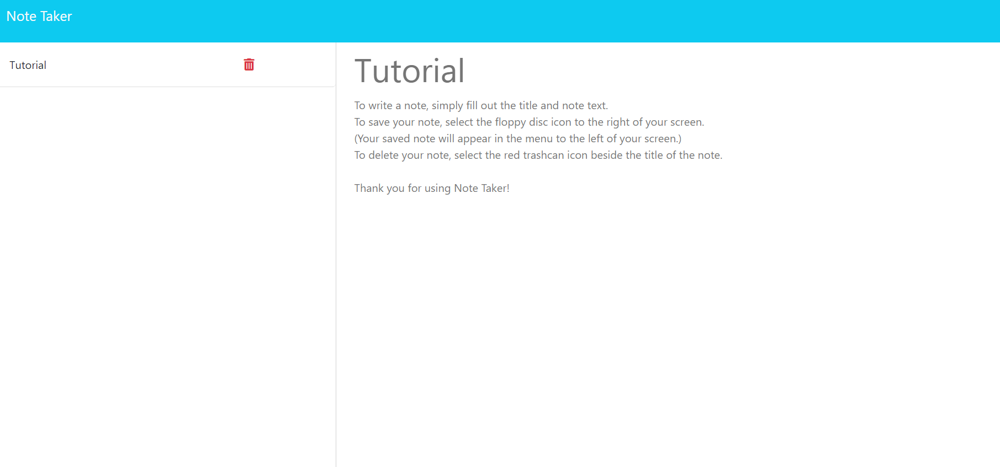

# Note Taker

## Description

This lightweight note taker uses Express.js to allow users to compose, save, and delete notes. Starter code for this project was provided by Denver University's Coding Boot Camp for a challenge assignment whose objective was to make the note-taker functional using Express.

## Installation

N/A - Please see usage for user instruction.

## Usage

To use this app, begin by navigating to (https://thawing-wave-62214-12d10afe8b27.herokuapp.com) in your browser of choice. Ensure all the keys on your keyboard function properly - especially your M key - and begin entering the title for your note in the <i>Note Title</i> field. Proceed with composing the rest of your note in the <i>Note Text</i> field. To save your note, select the floppy disc icon to the right of your screen. Your note will appear in the sidebar to the left of your screen. Use the plus (+) symbol to create more notes. Select the red trashcan icon by a saved note to permanently delete it.

## Credits

https://nodejs.org/en

https://expressjs.com

## Tests

Testing is currently unavailable for this application.

## Contributing

Contributing is not permitted for this application.

## License

N/A
